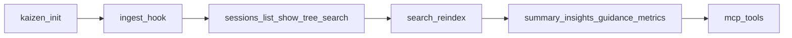

# Kaizen Smoke Tests: MCP and Manual Surfaces

Run [base setup](kaizen-local-smoke-tests.md) and
[workflow tiers](kaizen-local-smoke-tests-workflows.md) first.

## Tier K: MCP

The authoritative in-process harness is
`tests/mcp_tools_smoke.rs`. For subprocess smoke, start:

```bash
$KAIZEN_BIN mcp
```

### Tool Manifest

Assert `tools/list` matches `tests/mcp_tool_names.inc`. Current names:

| # | Tool |
|---:|---|
| 1 | `get_session_span_tree` |
| 2 | `kaizen_annotate_session` |
| 3 | `kaizen_capabilities` |
| 4 | `kaizen_exp_archive` |
| 5 | `kaizen_exp_conclude` |
| 6 | `kaizen_exp_list` |
| 7 | `kaizen_exp_new` |
| 8 | `kaizen_exp_report` |
| 9 | `kaizen_exp_start` |
| 10 | `kaizen_exp_status` |
| 11 | `kaizen_exp_tag` |
| 12 | `kaizen_ingest_hook` |
| 13 | `kaizen_init` |
| 14 | `kaizen_insights` |
| 15 | `kaizen_metrics` |
| 16 | `kaizen_metrics_index` |
| 17 | `kaizen_retro` |
| 18 | `kaizen_session_show` |
| 19 | `kaizen_sessions_list` |
| 20 | `kaizen_summary` |
| 21 | `kaizen_sync_run` |
| 22 | `kaizen_sync_status` |
| 23 | `kaizen_tui` |
| 24 | `kaizen_search_sessions` |

Also run `tests/mcp_parity.rs`.

### Representative Calls

After `initialize` and `notifications/initialized`, exercise:

- `kaizen_capabilities`
- `kaizen_init`
- session list, show, search, summary, insights, and metrics
- metrics index
- `kaizen_sync_run` with `{ "once": true }`
- sync status
- TUI stub, expecting an error because TUI is CLI-only
- session span tree
- hook ingest with a stringified `Stop` payload
- annotate, experiment lifecycle, and retro dry-run

Prefer the pinned `rmcp` client pattern from tests. Fallback:

```bash
cargo test -p kaizen-cli --test mcp_tools_smoke -- every_mcp_tool_runs
cargo test -p kaizen-cli --test mcp_parity
```

## Tier L: Conditional Checks

| Area | Requirement |
|---|---|
| `eval run`, `eval list`, `eval prompt` | Enabled eval config and judge API key. |
| `outcomes show` | Enabled outcome collection and measured session. |
| Internal sampler and outcome measurement | Run only for targeted regressions. |

## Tier M: TUI Manual Check

Launch `tui --workspace "$WORKDIR"`. Verify list, detail, and tree render. Exercise
`j`, `k`, Tab, `m`, `/`, `y`, Enter, `g`, `G`, `r`, `?`, `q`, Esc, and terminal
resize. Pass requires no panic and a clean exit.

## Data Flow



## Final Verification

```bash
cargo test
cargo clippy -- -D warnings
cargo fmt --check
```
