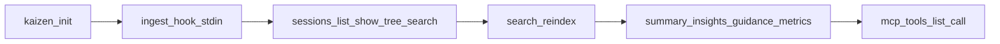

# Kaizen local smoke tests (agent checklist)

Exhaustive subprocess-oriented smoke coverage for Kaizen operating on **throwaway workspaces**. Use this doc as instructions for coding agents: each step lists intent, command shape, environment, and pass criteria.

Authoritative CLI surface lives in [`src/main.rs`](../../src/main.rs). User-facing semantics: [`docs/usage.md`](../usage.md). MCP mapping: [`docs/mcp.md`](../mcp.md).

## Audience and PASS criteria

**Goal.** Prove the local stack works: SQLite (`.kaizen/kaizen.db`), optional tiered files under `.kaizen/`, Unix daemon/socket under `KAIZEN_HOME`, MCP stdio server, optional local HTTP proxy, sync with **no remote ingest**, and **file** telemetry only.

**PASS (default).** Exit code `0` unless the step explicitly expects failure. Plain-text output contains documented markers; **`--json` / MCP `json: true`** responses must parse as JSON (no stderr noise that breaks parsers—if logs go to stderr, ignore for JSON parse).

**Binary.** Set `KAIZEN_BIN` to the absolute path of `kaizen` (`target/debug/kaizen` after `cargo build`, or `$CARGO_BIN_EXE_kaizen` inside `cargo test` harnesses).

All examples use `$KAIZEN_BIN`; substitute your path.

### Version bump (always, before smoke)

Before **`cargo build`**, **`cargo test`**, or any subprocess smoke:

1. **Bump** `[package].version` in the repo root [`Cargo.toml`](../../Cargo.toml) so the binary and MCP `initialize` version string match the change set you are validating.
2. When the change is user-facing, add or extend an entry under **`[Unreleased]`** in [`CHANGELOG.md`](../../CHANGELOG.md) (project release discipline).

Stale versions make smoke reports ambiguous (installed `PATH` bin vs `./target`; host caches). Treat “bump → build → smoke” as one sequence.

### Isolation (required)

- **`WORKDIR`** — empty directory that becomes the primary workspace root (`cd` here for relative paths).
- **`KAIZEN_HOME`** — **fresh directory** per run (or per suite) so `machine.db`, `daemon.sock`, `daemon.pid`, `daemon.log` do not collide with a developer installation. Example layout:

```bash
TMP="$(mktemp -d)"
export KAIZEN_HOME="$TMP/kaizen-home"
mkdir -p "$KAIZEN_HOME"
export WORKDIR="$TMP/ws-main"
mkdir -p "$WORKDIR"
```

Use current timestamps for newly ingested sessions so retention/GC checks do not prune them before later feedback or experiment steps:

```bash
NOW_MS="$(($(date +%s) * 1000))"
```

- Optional second workspace for `--all-workspaces` tests:

```bash
export WORKDIR2="$TMP/ws-other"
mkdir -p "$WORKDIR2"
```

Unset or override **`OPENCLAW_HOME` / `OPENCLAW_STATE_DIR`** only if you intend to exclude OpenClaw tails; scoped smoke does not require them.

### Out of scope (do not fail the suite)

Treat these as **SKIP** rows in your runner, not blockers:

- OpenClaw hook files and **`OPENCLAW_*`** transcript tails.
- **Datadog, PostHog, OTLP** telemetry exporters and `kaizen telemetry push` into non-`file` sinks.
- **`kaizen telemetry doctor` / `telemetry pull`** when `telemetry.query.provider` targets a remote vendor.
- **`--source provider` / `--source mixed`** on `summary`, `insights`, `guidance`, `metrics`, `retro` (remote/cache path).
- **Tier-1 tail agents** (Goose, OpenCode, Copilot paths) unless you provide fixtures under real OS paths—the default smoke uses **stdin hook ingest** only.
- **`kaizen eval run`** without judge API credentials (see Tier L).

### CLI parity note (`--help`)

Nested `--help` for subcommands is covered in CI by [`tests/cli_help_smoke.rs`](../../tests/cli_help_smoke.rs) and [`tests/cli_help_matrix.inc`](../../tests/cli_help_matrix.inc).

---

## Global preconditions (G0)

| ID | Command | cwd | PASS |
|----|---------|-----|------|
| G0.1 | `$KAIZEN_BIN --version` | any | `0`; stdout matches bumped [`Cargo.toml`](../../Cargo.toml) `[package].version` (and mentions `kaizen`) |
| G0.2 | `$KAIZEN_BIN --help` | any | `0`; non-empty grouped subcommands |
| G0.3 | `$KAIZEN_BIN summary` | `$WORKDIR` after init (Tier A) | `0` with default daemon behaviour |
| G0.4 | `$KAIZEN_BIN --no-daemon summary` | `$WORKDIR` | `0`; same sensible output as G0.3 for same DB state |
| G0.5 | `$KAIZEN_BIN summary --workspace "$WORKDIR"` | `/` or `$TMP` | `0`; same as running inside `$WORKDIR` |

---

## Tier A — Workspace bootstrap

| ID | Action | PASS |
|----|--------|------|
| A1 | `$KAIZEN_BIN init --workspace "$WORKDIR"` | `$WORKDIR/.kaizen/config.toml` exists; Cursor/Claude hook scaffolding per [usage](../usage.md); second run exits `0` (idempotent) |
| A2 | `$KAIZEN_BIN doctor --workspace "$WORKDIR"` | Exit `0`; store open; writable `.kaizen` |
| A3 | (optional negative) Break `.kaizen` permissions then `doctor` | Exit **non-zero** as documented ([usage](../usage.md#kaizen-doctor)); restore permissions after |

Skip validating OpenClaw-specific hook artifacts unless explicitly testing OpenClaw.

---

## Tier BD — Daemon lifecycle (optional but recommended)

Matches the integration pattern in [`tests/spec/daemon_lifecycle.rs`](../../tests/spec/daemon_lifecycle.rs).

| ID | Action | PASS |
|----|--------|------|
| B.D1 | `$KAIZEN_BIN daemon start --background` with `KAIZEN_HOME` set | Exits `0`; stdout prints pid/socket/log; `daemon.pid` and socket exist under `$KAIZEN_HOME` |
| B.D2 | `$KAIZEN_BIN daemon status` | Exit `0`; prints pid/uptime-ish fields |
| B.D3 | After ingest (Tier B below), `$KAIZEN_BIN daemon stop` | Exit `0`; subsequent `daemon status` reflects stopped state |

Alternatively run ingest with **`--no-daemon`** / `KAIZEN_DAEMON=0` for simpler CI—still document **one** daemon path in a full audit.

---

## Tier B — Ingest and session reads

**Minimal hook line** (SessionStart)—pipe on stdin:

```json
{"event":"SessionStart","session_id":"smoke-s1","timestamp_ms":CURRENT_NOW_MS}
```

Claude Code uses `hook_event_name` instead of Cursor's `event` key:

```json
{"hook_event_name":"SessionStart","session_id":"smoke-s2","timestamp_ms":CURRENT_NOW_MS}
```

| ID | Command | stdin | PASS |
|----|---------|-------|------|
| B1 | `$KAIZEN_BIN ingest hook --source cursor --workspace "$WORKDIR"` | SessionStart JSON | `0`; session id appears in later list |
| B2 | SessionStart with new `session_id` + **`--source claude`** | Claude-shaped JSON | `0`; second session appears |
| B3 | `$KAIZEN_BIN sessions list --workspace "$WORKDIR"` and `--json` | — | `0`; JSON parses; contains expected ids |
| B4 | `$KAIZEN_BIN sessions show <id> --workspace "$WORKDIR"` | — | `0`; includes `trace_path` (possibly empty string) |
| B5 | `$KAIZEN_BIN sessions tree <id> --workspace "$WORKDIR"` | — | `0`; ASCII tree |
| B5b | Same with `--depth 2` | — | `0`; shallower tree |
| B5c | Same with `--json` | — | `0`; JSON array/object per CLI contract |
| B6 | `$KAIZEN_BIN sessions search "smoke" --workspace "$WORKDIR" --limit 10` | — | `0`; hits or empty array; stderr may warn if index missing |
| B6b | Add `--since 7d`, `--agent cursor`, **`--kind`** if events exist | — | `0`; filters accepted without panic |
| B7 | `$KAIZEN_BIN search reindex --workspace "$WORKDIR"` | — | `0`; `.kaizen/search/` populated/updated |
| B8 | Re-run B6 search | — | Prefer **no** fallback-to-scan warning once index healthy |

Fixture ideas for richer trees: append `Stop`/`Tool_*` payloads via additional `ingest hook` stdin lines; see MCP smoke’s `Stop` event in [`tests/mcp_tools_smoke.rs`](../../tests/mcp_tools_smoke.rs).

---

## Tier C — Aggregates and reports (stay on local source)

Keep default **`--source local`** everywhere below (do not pull provider cache).

| ID | Command variants | PASS |
|----|------------------|------|
| C1 | `summary`, `summary --json`, `summary --refresh` | All `0`; `--json` object has workspace/stats shapes per docs |
| C1b | **`summary --all-workspaces`** | `0`; run `init` in `$WORKDIR2` + minimal ingest OR document SKIP if single workspace |
| C2 | `insights`, `insights --refresh`, `insights --all-workspaces` | `0`; human output or documented JSON expectations |
| C3 | `guidance`, `guidance --days 14`, `guidance --json`, `guidance --refresh` | `0` |
| C4 | `metrics --days 7`, `--json`, **`--force`**, `--refresh`, `--all-workspaces` | `0` |
| C5 | `metrics index`, `metrics index --force --workspace "$WORKDIR"` | `0` |

`metrics index` works in plain throwaway directories via filesystem fallback. For git-history/branch binding assertions, run `git init` + one commit in that disposable workspace.

**`--all-workspaces` recipe:** register two roots by running **`init` (and optionally ingest)** in `$WORKDIR` and `$WORKDIR2` with shared `KAIZEN_HOME`; then invoke read commands from either cwd with `--all-workspaces`.

---

## Tier D — Retro, GC, migrate

| ID | Command | PASS |
|----|---------|------|
| D1 | `retro`, `retro --dry-run`, `retro --json`, `retro --force` | `0`; `--dry-run` / `--json` avoid file write per [usage](../usage.md) |
| D2 | `gc --days 365` or large window on disposable data | `0`; run after feedback/experiment checks when using historical fixture timestamps |
| D2b | **`gc --vacuum`** | `0` (slow; acceptable on throwaway WS only) |
| D3 | **`migrate v2`** on copy of populated workspace | Use **dedicated clone**; `0`; backup artifact per docs |
| D3b | **`migrate v1`** rollback on same disposable tree | `0`; or STOP if no v2 migration was done |
| D3c | **`migrate v2 --allow-skew`** | `0` on fixture with awkward timestamps |

Invalid lifecycle commands (best-effort): e.g. `exp archive` before conclude—expect non-zero **if** documented.

---

## Tier E — Annotate, feedback, prompts

| ID | Command | PASS |
|----|---------|------|
| E1 | `sessions annotate <id> --score 3 --label good --note "smoke" --workspace "$WORKDIR"` | `0`; `sessions show <id>` later lists feedback fragment |
| E2 | `feedback list`, `feedback list --label bad`, `feedback list --since 7d`, `--json` | `0` |
| E3 | `prompt list`, `prompt list --json` | `0`; may be empty before prompt snapshots exist |
| E3b | If fingerprints exist from real hooks: `prompt show <prefix>`, `prompt diff <a> <b>` | `0` |

---

## Tier F — Experiments lifecycle

Minimal **manual binding** path (aligned with MCP smoke in [`tests/mcp_tools_smoke.rs`](../../tests/mcp_tools_smoke.rs)):

1. **`exp power --metric tokens_per_session --baseline-n 50`**
2. **`exp new --name smoke --hypothesis h --change c --metric cost_per_session --bind manual`** (capture printed UUID after `created `).
3. **`exp list`**, **`exp status <id>`**
4. **`exp start <id>`**
5. **`exp tag <id> --session <sid> --variant control`** (`sid` from Tier B ingest)
6. **`exp report <id>`** and **`exp report <id> --json`**
7. **`exp conclude <id>`**
8. **`exp archive <id>`**

**Git / branch bindings:** repeat `exp new` with **`--bind git`** (requires commits) or **`--bind branch --control-branch main --treatment-branch feature/x`** where branches exist—document SKIP if bare repo.

Spot-check **`exp archive` before `conclude`** → expect failure or stable error messaging.

---

## Tier G — Sync (no live ingest server)

Assume **`[sync].endpoint`** empty / unset (default disabled).

| ID | Command | PASS |
|----|---------|------|
| G1 | `sync status --workspace "$WORKDIR"` | `0`; stable semantics for disabled / zero outbox |
| G2 | `sync run --once --workspace "$WORKDIR"` | `0`; **no mandatory network dependency** |

Do not assert successful HTTP ingest without a designated mock server.

---

## Tier H — Local HTTP proxy

Per [`docs/llm-proxy.md`](../llm-proxy.md):

| ID | Action | PASS |
|----|--------|------|
| H1 | Start `$KAIZEN_BIN proxy run --listen 127.0.0.1:0 --workspace "$WORKDIR"` (or ephemeral port passed explicitly) | Process binds; stays alive until signaled |
| H2 | `curl -s -o /dev/null -w "%{http_code}"` against **non-Anthropic** path or malformed request | Smoke **counts bind + responsiveness**—502/4xx acceptable; no immediate crash |

Stop with SIGTERM / timeout SIGKILL cleanup.

---

## Tier I — Telemetry (file sink only)

Use **temporary `HOME`** for anything that edits `~/.kaizen/config.toml` via **`telemetry configure` / `telemetry init`** so you never corrupt a developer machine:

```bash
export HOME="$TMP/fake-home"
mkdir -p "$HOME/.kaizen"
```

Minimal workspace file exporter in `$WORKDIR/.kaizen/config.toml`:

```toml
[[telemetry.exporters]]
type = "file"
# path defaults to .kaizen/telemetry.ndjson
enabled = true
```

| ID | Command | PASS |
|----|---------|------|
| I1 | `telemetry print-schema` | `0`; JSON-ish schema listing |
| I2 | `telemetry print-effective-config --workspace "$WORKDIR"` | `0`; redacted merged resolution |
| I3 | **`telemetry configure --type file --path telemetry.ndjson`** against fake `HOME` | Appends file exporter template; verify file diff |
| I4 | Trigger at least one exporter write (e.g. run `sync run --once` if outbox path exercises fan-out, or document **SKIP** if no events batch in test env) | **If** `telemetry.ndjson` exists: **`telemetry tail --no-follow --workspace "$WORKDIR"`** `0` |
| I5 | `telemetry tail --json --no-follow` | `0`; each line parses as JSON when file non-empty |

**SKIP:** `telemetry push` with PostHog/Datadog/OTLP, `telemetry doctor` depending on remote health, `telemetry pull` for provider-backed queries.

---

## Tier J — Completions

| ID | Command | PASS |
|----|---------|------|
| J1–J5 | `completions bash`, `zsh`, `fish`, **`elvish`**, **`powershell`** | Each `0` (or POSIX success); **non-empty stdout** |

---

## Tier K — MCP (`kaizen mcp`)

The crate test [`tests/mcp_tools_smoke.rs`](../../tests/mcp_tools_smoke.rs) is the authoritative **in-process** harness (Tokio duplex + `KaizenMcp`). For **subprocess** smoke, spawn:

```bash
$KAIZEN_BIN mcp   # cwd = workspace or rely on tool `workspace` args
```

### K1 — Tool manifest

Assert **`tools/list`** (exact names, sorted) matches:

<!-- sync: tests/mcp_tool_names.inc -->

| # | MCP tool name |
|---|----------------|
| 1 | `get_session_span_tree` |
| 2 | `kaizen_annotate_session` |
| 3 | `kaizen_capabilities` |
| 4 | `kaizen_exp_archive` |
| 5 | `kaizen_exp_conclude` |
| 6 | `kaizen_exp_list` |
| 7 | `kaizen_exp_new` |
| 8 | `kaizen_exp_report` |
| 9 | `kaizen_exp_start` |
| 10 | `kaizen_exp_status` |
| 11 | `kaizen_exp_tag` |
| 12 | `kaizen_ingest_hook` |
| 13 | `kaizen_init` |
| 14 | `kaizen_insights` |
| 15 | `kaizen_metrics` |
| 16 | `kaizen_metrics_index` |
| 17 | `kaizen_retro` |
| 18 | `kaizen_session_show` |
| 19 | `kaizen_sessions_list` |
| 20 | `kaizen_summary` |
| 21 | `kaizen_sync_run` |
| 22 | `kaizen_sync_status` |
| 23 | `kaizen_tui` |
| 24 | `mcp/search_sessions` |

Canonical source in repo: [`tests/mcp_tool_names.inc`](../../tests/mcp_tool_names.inc).

Also cross-check MCP vs CLI gaps in [`tests/mcp_parity.rs`](../../tests/mcp_parity.rs).

### K2 — Representative `call_tool` sequence

After `initialize` + `notifications/initialized`, exercises matching [`tests/mcp_tools_smoke.rs`](../../tests/mcp_tools_smoke.rs):

- `kaizen_capabilities` `{}`
- `kaizen_init` `{ "workspace": "<path>" }` (idempotent safe path)
- `kaizen_sessions_list` with `workspace` + `json: true`
- `kaizen_session_show` for known `id`
- `mcp/search_sessions` `{ "workspace", "query", "limit" }`
- `kaizen_summary` `json: true`
- `kaizen_insights`, `kaizen_metrics`, **`kaizen_metrics_index`**
- `kaizen_sync_run` **`{ "once": true }` only** for continuous-sync guard
- `kaizen_sync_status`
- **`kaizen_tui`** — expect **`is_error: true`** (CLI-only)
- **`get_session_span_tree`** `json: true`
- **`kaizen_ingest_hook`** with stringified **`Stop`** JSON (`payload`)
- annotate + full **exp** lifecycle (`kaizen_exp_*`)
- **`kaizen_retro`** `dry_run` + `json`

### K3 — JSON-RPC scaffolding hint

Prefer reusing **`rmcp`** client patterns from tests or a short Python **`json.dumps` per line over stdio**—wire format must match MCP/stdio expectations of the pinned `rmcp` version. Agents may **delegate** MCP smoke to:

```bash
cargo test -p kaizen-cli --test mcp_tools_smoke -- every_mcp_tool_runs
cargo test -p kaizen-cli --test mcp_parity
```

if subprocess JSON-RPC framing is brittle in their environment.

---

## Tier L — Conditional / optional

| Area | When to run |
|------|----------------|
| **`eval run`**, `eval list`, `eval prompt` | **`[eval].enabled`** + **`ANTHROPIC_API_KEY`** (or `[eval].api_key`) |
| **`outcomes show`** | **`[collect.outcomes] enabled`** and a measured session (`outcomes measure` internally triggered) |
| **`__sampler-run`**, `outcomes measure` | Lowest priority smoke; intended for internal regressions |

---

## Tier M — TUI manual checklist

Fully automated parity is fragile for Ratatui. **Manual PASS** acceptable.

Reference [`tests/cli_help_smoke.rs`](../../tests/cli_help_smoke.rs) module docs and [`src/ui/tui.rs`](../../src/ui/tui.rs) help:

Launch `$KAIZEN_BIN tui --workspace "$WORKDIR"`, verify session list renders, exercise **`j`**/**`k`**, Tab, **`m`**, `/`, **`y`**, Enter, **`g`**/**`G`**, **`r`**, **`?`**, **`q`**/Esc, window resize—no panic, clean exit.

---

## Appendix — Suggested data flow for agents



---

## Appendix — Verification helpers (recommended before merge)

```bash
cargo test && cargo clippy -- -D warnings && cargo fmt --check
```

Add targeted tests after automating subsets of this plan (Rust integration tests mirroring tiers B–K).
