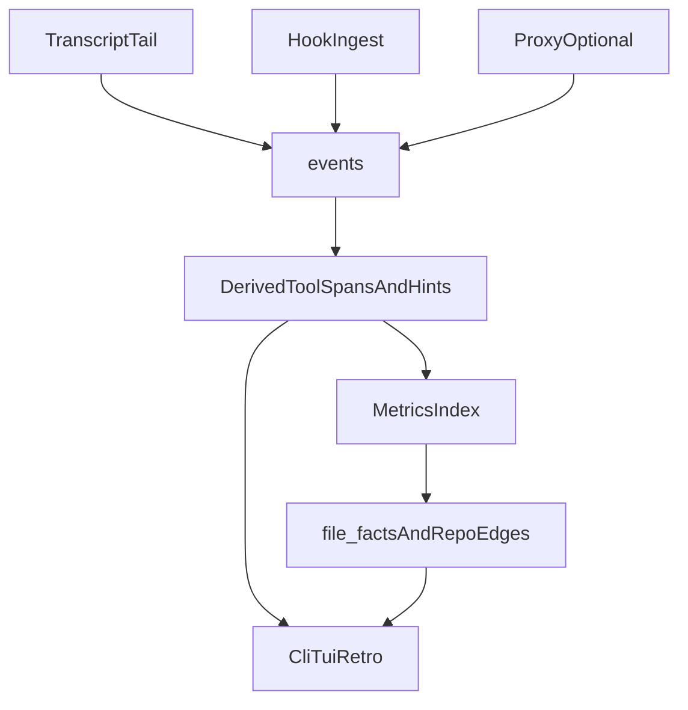

# From agent session to stored facts

This page is the “red thread” for understanding **what kaizen records** and **in what order**, without reading Rust. If you only read one explainer, read this. The glossary in [concepts.md](concepts.md) and the schema detail in [datamodel.md](datamodel.md) go deeper; [architecture.md](architecture.md) lists modules.

## How data enters kaizen

Coding agents (Cursor, Claude Code, Codex, and more via tail) leave traces in two main ways, plus an optional third:

| Source | What it is | When it matters |
|--------|------------|-----------------|
| **Transcript tail (Tier 1)** | Watches known JSONL directories with file notifications, parses lines as the agent appends. | You want the full conversation and tool log as the agent product writes it. No change to the agent’s HTTP stack. |
| **Hooks (Tier 2)** | `kaizen init` patches hooks so the host sends events to `kaizen ingest hook`. | You want lower-latency or host-specific events the transcript might omit or represent differently. |
| **LLM HTTP proxy (optional)** | `kaizen proxy run` sits in front of an Anthropic-style API and logs `EventSource::Proxy` rows. | You need **reliable** token counts for traffic that does not go through a captured transcript, or you point tools at a local base URL. |

For day-to-day use with the supported first-party agents, **transcript + hooks** is the usual model. The proxy is for operators who also want a single place that sees HTTP-level model calls. See [llm-proxy.md](llm-proxy.md) and [mcp.md](mcp.md) for host-specific wiring; MCP is how another agent *queries* kaizen, not a fourth ingest tier.

## The pipeline in one breath

1. A **Session** is one agent run; it has metadata (agent, model, workspace, times, status).
2. Ingestion appends to **`events`**: turns, tool calls, hooks, cost hints, and proxy completions. Order is by `event_seq` within a session.
3. On append, the store maintains **derived views**: `tool_spans`, and fields such as files touched and skills used.
4. **Metrics** (when you run indexing or commands that need it) walks git and the tree, builds **repo snapshots** and **file facts**, and fills the **code graph** sidecar (`file_facts`, `repo_edges`) used by the TUI, reports, and retro.
5. **CLI / TUI / retro** read that material; **sync** and optional **telemetry exporters** send only **redacted** batches off machine if you configure them.

Nothing leaves your disk until you opt in. See [concepts.md](concepts.md#redact) for redaction and [ingest-contract.md](ingest-contract.md) for the sync contract.

## Diagram: from activity to queryable data



The same **events** table is the source of truth: derived and snapshot tables can be rebuilt from it (see [datamodel.md](datamodel.md#invariants)).

## Try it in about five minutes

From a repository where you use an agent (so transcripts exist) or where you are willing to generate one short session:

1. **Initialize** the workspace (idempotent).

   ```bash
   kaizen init
   ```

2. **List sessions** kaizen can see in this workspace (it may index and tail as needed).

   ```bash
   kaizen sessions list
   ```

   You should get a table of session ids, agents, models, and times. If the list is empty, confirm the agent has written under the paths in [concepts.md](concepts.md#collection) and that `sources` in [config.md](config.md) include your agent.

3. **Roll up cost** across those sessions.

   ```bash
   kaizen summary
   ```

   Expect totals and breakdowns by agent or model, depending on what was captured.

4. **Inspect one session** (copy an id from step 2).

   ```bash
   kaizen sessions show "<session-id>"
   ```

   You should see the event stream, tool-related detail, and cost where available. Cursor’s token counts are heuristic when the transcript does not carry native usage; Claude Code and proxy-backed calls can be more exact.

5. **Optional: live browser.**

   ```bash
   kaizen tui
   ```

If these steps work, the full pipeline is alive in your environment: **collection → store → your commands**.

## What this teaches about “LLM and the codebase”

kaizen does not implement the model. It **observes** how an agent: requests tools, reads and edits files, and moves through your tree over time. **Tool spans** and **file facts** connect “what the agent did” to “where in the repo it mattered,” which is why retro and experiments can suggest repo-level changes (rules, skills, structure) with metrics grounded in your history. For experiment semantics, see [experiments.md](experiments.md).

## Sending sessions to a third-party telemetry provider

Once you have local sessions, you can fan them out to PostHog, Datadog, OTLP, or a local NDJSON file with the same redacted payload that Kaizen sync would post. The default Cargo build ships PostHog, Datadog, and OTLP exporters; `dev` tracing is opt-in. The end-to-end flow is:

```bash
# 1. Configure once — the wizard validates credentials with a live `health` call.
export DD_API_KEY=...
export DD_SITE=us5.datadoghq.com
kaizen telemetry configure --type datadog --non-interactive

# 2. Smoke-test the wiring with one synthetic event (per-sink ok/fail report).
kaizen telemetry test

# 3. Replay a window of stored sessions through every configured exporter (no Kaizen POST).
kaizen telemetry push --days 7

# 4. Inspect provider state.
kaizen telemetry doctor
kaizen telemetry pull --days 1   # Datadog Logs Search v2; requires DD_APP_KEY too
```

**No Kaizen account needed.** When `[sync].team_salt_hex` is empty, telemetry-only flows generate `~/.kaizen/local_salt.hex` (`chmod 0o600`) on first use and reuse it forever. The salt drives session/workspace id hashing and payload redaction the same way the team salt would.

**Datadog credentials.** DD has two independent secrets and the wizard treats them differently. The **API Key** (32 hex chars, org-scoped, identifies the org) is required for log intake and gets persisted to `[[telemetry.exporters]]`; the wizard rejects `ddapp_*` Application Keys before the network round-trip because DD always 403s on that mistake. The **Application Key** (40 chars prefixed `ddapp_`, user-scoped) is only required for `kaizen telemetry pull` (Logs Search v2) and stays env-only via `DD_APP_KEY` — we deliberately do not persist user-scoped keys in TOML. Generate keys at Org Settings > API Keys and Personal Settings > Application Keys respectively.

**Datadog log shape.** Each canonical item becomes one DD log object with top-level `timestamp`, `hostname`, `service: "kaizen"`, `ddsource: "kaizen"`, `project_name`, plus `agent`, `model`, `kind`, `lead_time_ms`, token counts, and cost fields promoted out of the payload so they drive DD facets. `project_name` comes from the GitHub origin repo name when available, otherwise from the workspace folder name; `workspace_hash` stays unchanged for joins. The full canonical item is nested under `kaizen` for users who want raw detail. Requests are chunked to respect DD's `1000` entries / ~5 MB caps; partial-chunk failures are logged with the chunk index.

## See also

- [architecture.md](architecture.md) — module names and boundary list.
- [config.md](config.md) — `~/.kaizen` vs workspace, tail sources, sync, proxy, telemetry exporters.
- [usage-telemetry.md](usage-telemetry.md) — full CLI reference for the telemetry subcommands.
- [../AGENTS.md](../AGENTS.md) — note on Cursor cost telemetry limitations.

Long-form documentation is maintained in the **GitHub** tree under `docs/`. The [docs.rs](https://docs.rs/kaizen-cli) page documents the Rust library API for the published crate, not the full markdown book.
