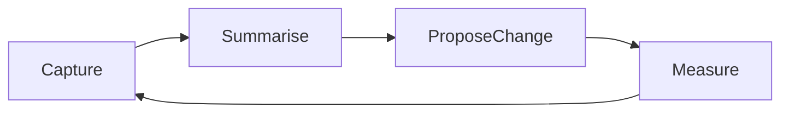

# Kaizen hands-on tutorial

Learn Kaizen by **using** it on a repo where you already run a coding agent (Cursor, Claude Code, Codex, or another [tailed](../concepts.md#collection) agent). You will wire capture, read the local store, interpret metrics, run a retro, and see how experiments and optional sync fit the same loop.

## Why this exists

Kaizen is a **feedback loop**, not a dashboard:

Transcripts and hooks **capture**; `summary`, `insights`, `guidance`, and `metrics` **summarise**; `retro`, `eval`, and `exp` **propose and measure** change. The deep data story is in [telemetry-journey.md](../telemetry-journey.md).

After you have sessions in the store you can run **`kaizen eval run`** to call an LLM judge (requires `[eval].enabled = true` and `ANTHROPIC_API_KEY`). Low-scoring sessions appear as the **H15** bet in `kaizen retro`. See [usage.md#kaizen-eval](../usage.md#kaizen-eval) and [config.md#eval](../config.md#eval) for setup.

## What you will know after

- How `init` wires hooks and where data lands on disk.
- When to use **cache-first** reads vs `--refresh`.
- How **`--source local|provider|mixed`** changes observe-style commands when sync identity and `[telemetry.query]` are configured (optional).
- How **`--all-workspaces`** aggregates across repos you have opened.
- Which workflows are **MCP** vs **shell-only**.
- Where to read next for proxy, sync, and experiments detail.

## Paths through this tutorial

| Time | Do this |
|------|---------|
| ~5 min | [Part 1](01-setup.md) → [Part 2](02-observe.md) first sections |
| ~30 min | Parts 1–4 |
| Deep dive | All parts 1–9 + linked reference docs |

## Parts

1. [Setup: install, init, doctor](01-setup.md)
2. [Observe: sessions, summary, TUI](02-observe.md)
3. [Interpret: insights and guidance](03-insights-guidance.md)
4. [Repo intelligence: metrics and refresh](04-metrics.md)
5. [Improve: retro](05-retro.md)
6. [Improve: experiments](06-experiments.md)
7. [Optional: proxy, sync, telemetry](07-proxy-sync-telemetry.md)
8. [Agents calling Kaizen: MCP](08-mcp.md)
9. [Housekeeping: gc and completions](09-housekeeping.md)

Full command flags: [usage.md](../usage.md). Glossary: [concepts.md](../concepts.md).
